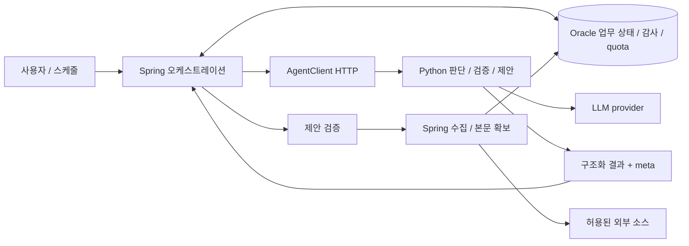
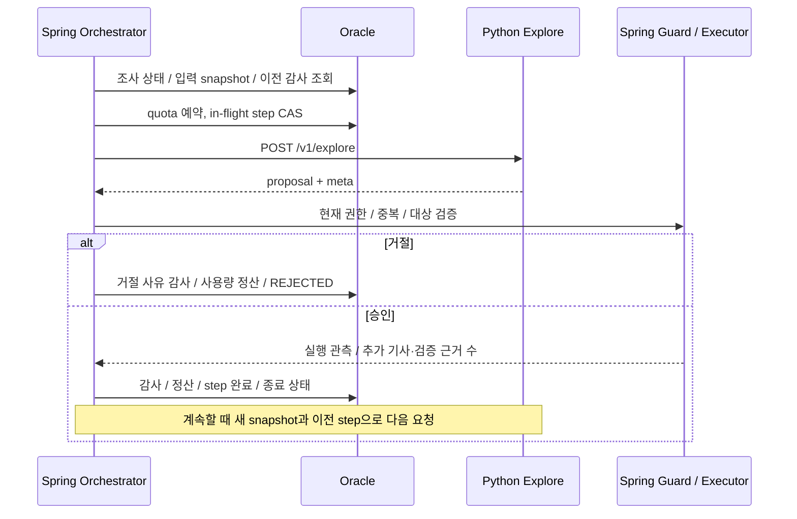

# M13 — Spring / Python 에이전트 경계

기준: 2026-09-04, `main`의 `f369068`(P3-2 머지) · [작업 #160](https://github.com/miro-oss/external_news_agent/issues/160)

Spring이 업무 상태·실행·예산을 소유하고, Python은 전달받은 입력에서 판단 결과를 반환한다.
현재도 `AgentClient`가 FastAPI를 HTTP로 호출한다. M13은 이 경계의 실제 구현과 교체 조건을
기록한다. PR #161 후속 리뷰에서 발견한 조사 실패 복구의 quota 정산 오류도 함께 보정한다.
제품 API와 DB 스키마는 변경하지 않는다.

## 1. 적용 범위와 정본

- 제품 API는 Notion [API 명세서](https://www.notion.so/3b82789f4f588022aa25d61d62fb6046)의
  [외부 뉴스 크롤링 에이전트 API](https://www.notion.so/3b82789f4f5880c08e40fbeb5d15a3b7)를 따른다.
  [공통 응답 규격 · 에러 코드](https://www.notion.so/3b82789f4f5881649892cfad034ab9ea)는
  내부 에이전트 API를 명시적으로 범위에서 제외한다. 내부 `/v1` 응답에 제품 API의
  `isSuccess/code/message/result` 봉투를 씌우지 않는다.
- 이번 문서에서 다루는 제품 경계는 [수동 수집 실행](https://www.notion.so/3b82789f4f588123ad8ecdb816db9fad),
  [보고서 상세 조회](https://www.notion.so/3b82789f4f588153b3d0ffd55a5178d9),
  [키워드 제안 승인](https://www.notion.so/3d02789f4f5881bda61ceeb03de292cc) 명세와 대조했다.
- 내부 wire 계약은 [Python schemas](agent/app/schemas/), [Java DTO](BE/src/main/java/com/example/be/domain/analysis/agent/dto/),
  [Agent README](agent/README.md), 양쪽 계약 테스트를 함께 대조한다. 어댑터 교체 시에도
  제품 HTTP 메서드·URI·필드·코드·사용자 메시지는 Notion 정본을 유지한다.
- 로컬 `docs/plan-master-v2.md` §11-6의 M13 DoD를 구체화했다. `docs/`는 Git ignore 대상이므로
  공유 산출물은 이 파일에 둔다. 초기 `plan-agent-final.md`의 예시 패키지, `SEARCH/READ/ANSWER`,
  “Spring만 provider 재시도” 설명은 현재 구현을 나타내지 않는다. 현재 action과 재시도 책임은 아래와 같다.

## 2. 소유권



| 책임 | Spring / Oracle | Python |
|---|---|---|
| 수집 실행 | 주제·소스·스케줄·run 생성/종료, robots·rate limit·본문 HTTP, 외부 I/O와 저장 트랜잭션 분리 | 기사나 외부 검색을 직접 실행하지 않음 |
| 이슈 구성 | URL/content 중복 처리·결정론적 클러스터링·IDF·상태/중요도 projection | 전달된 이슈 멤버에서 교차 출처 관측과 판단 반환 |
| 분석 | 분석 대상/상한 선택, 입력 hash 캐시, 검증 호출, 응답 검증·저장·대체 처리 | 문장 분할, 요약·분류·민감도 축·관점 태그, 근거 판정, 자기 검증 |
| 추가 조사 | snapshot 생성, 제안 승인/거절, 행동 실행, step/종료/복구 기록 | snapshot과 이전 step으로 다음 행동 하나 제안 |
| 보고서 | RUN/DAILY 대상·최신 근거·상위 이슈 선택, 생성 중복 방지, 저장·조회·발송 | 주어진 finding으로 초안, 결정론적 Markdown 렌더링·최종 근거 검증 |
| 인사이트/가설 | CURRENT/HISTORY 선택·저장·캐시·가설 watch와 후속 기사 연결 | 입력 근거에서 FACT/IMPLICATION/watch-next 생성·검증 |
| 키워드 전략 | scheduled run 입력 구성, PENDING 저장, 운영자 승인 시 현재 키워드에 반영 | ADD/REMOVE 제안과 이유 반환 |
| 예산·감사 | plan 결정, durable quota 예약/정산, `agent_runs` 및 조사 상태 저장 | provider 라우팅, 사용량 meta, 요청 hard cap·동시성·서킷·pacing 보호 |

Python의 **stateless는 영속 업무 상태가 없다는 뜻**이다. [router.py](agent/app/llm/router.py)의
provider 캐시, plan별 semaphore·circuit breaker·pacing 상태는 프로세스 메모리에 있다.
재시작하면 사라지고 여러 worker 사이에서 공유되지 않는다. 조사 이력·finding 캐시·일일 quota를
이 메모리로 대체할 수 없다. Python에는 Oracle 연결이나 업무 테이블 쓰기를 추가하지 않는다.

주요 Spring 진입점은 다음과 같다.

| 흐름 | 실제 코드 |
|---|---|
| 전체 실행 | [CollectionRunExecutionService](BE/src/main/java/com/example/be/domain/collection/service/command/CollectionRunExecutionService.java) |
| 분석 선택·재사용·저장 | [ArticleAnalysisPipeline](BE/src/main/java/com/example/be/domain/analysis/service/ArticleAnalysisPipeline.java), [FindingWriter](BE/src/main/java/com/example/be/domain/analysis/service/FindingWriter.java) |
| 분석·근거·자기 검증 | [AgentAnalysisOrchestrator](BE/src/main/java/com/example/be/domain/analysis/agent/service/AgentAnalysisOrchestrator.java) |
| 조사 | [IssueInvestigationOrchestrator](BE/src/main/java/com/example/be/domain/analysis/agent/investigation/IssueInvestigationOrchestrator.java), [Guard](BE/src/main/java/com/example/be/domain/analysis/agent/investigation/IssueInvestigationGuard.java), [ActionExecutor](BE/src/main/java/com/example/be/domain/analysis/agent/investigation/IssueInvestigationActionExecutor.java) |
| 보고서 | [AgentReportOrchestrator](BE/src/main/java/com/example/be/domain/reports/service/AgentReportOrchestrator.java), [DailyReportCreationService](BE/src/main/java/com/example/be/domain/reports/service/DailyReportCreationService.java) |
| 인사이트·키워드 | [InsightService](BE/src/main/java/com/example/be/domain/insights/service/InsightService.java), [TopicKeywordStrategyOrchestrator](BE/src/main/java/com/example/be/domain/topics/service/strategy/TopicKeywordStrategyOrchestrator.java) |
| durable 예산·감사 | [AgentQuotaService](BE/src/main/java/com/example/be/domain/analysis/agent/quota/AgentQuotaService.java), [AgentRunRecorder](BE/src/main/java/com/example/be/domain/analysis/agent/service/AgentRunRecorder.java), [조사 저장소](BE/src/main/java/com/example/be/domain/analysis/agent/investigation/IssueInvestigationJdbcRepository.java) |

## 3. 현재 HTTP 어댑터와 계약

[AgentClient](BE/src/main/java/com/example/be/domain/analysis/agent/client/AgentClient.java)는
`RestClient`를 사용하는 **concrete class**다. 여섯 POST 경로와 일곱 Java 호출 메서드를 가진다.
[FastAPI router](agent/app/api/v1/)와 [서비스 구현](agent/app/llm/)이 반대편 경계다.

| Java 메서드 / 감사 task | HTTP | 요청 snapshot → 판단 결과 | Python 계약 |
|---|---|---|---|
| `analyze` / `ANALYZE` | `POST /v1/analyze` | 기사·주제·이슈 멤버 → sentences·요약·분류·sections·교차 출처 | [analyze.py](agent/app/schemas/analyze.py) |
| `selfCritique` / `SELF_CRITIQUE` | `POST /v1/analyze` | `selfCritique=true`, `previousFinding` → 선택 주장 최대 1건의 검토 결과 | [analyze.py](agent/app/schemas/analyze.py) |
| `verifyEvidence` / `VERIFY_EVIDENCE` | `POST /v1/verify-evidence` | `claims[]`와 근거 문장 → claimId별 판정·허용 문장·사유 | [evidence.py](agent/app/schemas/evidence.py) |
| `report` / `REPORT` | `POST /v1/report` | RUN/DAILY 컨텍스트·선택 finding → 검증된 보고서 | [report.py](agent/app/schemas/report.py) |
| `insight` / `INSIGHT` | `POST /v1/insight` | 관점·CURRENT/HISTORY finding → 관점별 facts·implications | [insight.py](agent/app/schemas/insight.py) |
| `explore` / `INVESTIGATE` | `POST /v1/explore` | 이슈·허용 소스·이전 step → proposal 하나 | [explore.py](agent/app/schemas/explore.py) |
| `keywordStrategy` / `KEYWORD_STRATEGY` | `POST /v1/keyword-strategy` | 주제 키워드·scheduled run 통계/기사 → 변경 제안 | [keyword_strategy.py](agent/app/schemas/keyword_strategy.py) |

`GET /v1/health`는 별도 인증 없는 헬스 체크이며 판단 호출이 아니다.
`SELF_CRITIQUE`와 `INVESTIGATE`는 Spring 감사 구분이다. 별도 `/v1/self-critique`나
`/v1/investigate` 엔드포인트는 없다.
`AgentTask.EXPLORE`는 enum과 기존 DB 제약에 남아 있는 미사용 값이다. 현재 `/v1/explore` 호출은
반드시 `INVESTIGATE`로 예약·감사한다. 조사 예산·사용량 집계가 이 task를 기준으로 하므로
경로 이름을 보고 `EXPLORE`로 바꾸면 조사 상한에서 누락된다.

교체 구현이 유지해야 하는 사항:

1. **인증·전송**: POST는 JSON과 `X-Agent-Token`을 사용한다. [security.py](agent/app/core/security.py)가
   미설정·누락·불일치 토큰을 `401 UNAUTHORIZED`로 거절한다. 활성 Spring 클라이언트는 HTTPS,
   또는 개발용 loopback HTTP만 허용한다. 실제 토큰은 문서·DB·응답에 넣지 않는다.
2. **입력 완결성**: 각 요청은 `idempotencyKey`, `plan`과 해당 판단에 필요한 snapshot을 전달한다.
   Python이 이전 호출의 대화·DB 상태를 찾아야만 처리할 수 있는 계약을 만들지 않는다.
   camelCase wire 필드와 Pydantic의 `extra=forbid`·입력 상한을 유지한다.
3. **근거 번호**: 분석의 `sentences` 순서가 기준이며 내부 `evidenceSentenceIds`는 **1-based**다.
   Spring이 저장/제품 API의 **0-based** 인덱스로 변환한다. 검증·자기 검증으로 돌려보낼 때 역변환한다.
   어댑터가 문장을 다시 분할하거나 순서를 바꾸면 안 된다. `claimType`, `attributedTo`,
   `groundedness`, 사유, unavailable 민감도 축도 보존한다. 민감도 총점은 Spring이 계산한다.
4. **결과 검증·사용량**: 성공 응답은 raw DTO와 `meta`이며 `provider`, `model`, `promptVersion`,
   `inputTokens`, `outputTokens`, `costUsd`, `credits`, `mock`, `truncated`를 전달한다.
   Spring의 도메인 검증을 우회하지 않는다. Mock/Stub을 실제 LLM 성공으로 기록하지 않고
   `truncated` 표시를 보존한다. 현재 분석 캐시는 입력 잘림 여부를 보존해 재사용하며,
   인사이트와 키워드 전략은 잘린 응답을 거절한다. task별 정책을 동일하게 취급하지 않는다.
5. **오류**: 정의된 Agent/입력 검증/예상 밖 오류 handler는 `{error:{code,message,details}}`를 반환한다.
   입력 오류는 `422 SCHEMA_VIOLATION`, 예상 밖 오류는 `500 INTERNAL_ERROR`다.
   기본 FastAPI 404/405까지 같은 형식이라는 보장은 없다. [AgentErrorResponse](BE/src/main/java/com/example/be/domain/analysis/agent/dto/AgentErrorResponse.java)의
   `details.usage`가 있으면 실패 사용량도 전달한다. 오류별로 없을 수 있으므로 0으로 꾸미지 않는다.
6. **시간 제한**: 연결 timeout과 응답 대기 timeout을 구분해 `AgentClientException.TimeoutPhase`를
   보존한다. analyze·evidence·explore·selfCritique는 analyze 클라이언트, insight·keywordStrategy는
   insight 클라이언트, report는 report 클라이언트를 쓴다. 실제 값은
   [application.yml](BE/src/main/resources/application.yml), [AgentProperties](BE/src/main/java/com/example/be/domain/analysis/agent/config/AgentProperties.java),
   [Python Settings](agent/app/core/config.py)를 함께 확인한다. provider timeout은 별개이며
   pacing·재시도·repair가 전체 시간을 늘릴 수 있다. Spring read timeout은 provider 작업 취소를 보장하지 않는다.

현재 내부 오류 handler가 반환하는 HTTP 상태와 코드 조합은 다음과 같다.

| HTTP | `error.code` | 원인 / 코드 근거 |
|---|---|---|
| 401 | `UNAUTHORIZED` | [security.py](agent/app/core/security.py)의 토큰 미설정·누락·불일치 |
| 413 | `INPUT_TOO_LARGE` | [evidence_service.py](agent/app/llm/evidence_service.py)의 근거 검증 입력 한도 |
| 422 | `SCHEMA_VIOLATION` | [main.py](agent/app/main.py)의 요청 스키마 검증 |
| 429 | `BUDGET_EXCEEDED` | [guarded_provider.py](agent/app/llm/guarded_provider.py)의 응답 후 credits hard cap 초과 |
| 429 | `PROVIDER_UNAVAILABLE` | [explore_service.py](agent/app/llm/explore_service.py)의 PAID PydanticAI upstream 429 |
| 502 | `SCHEMA_VIOLATION` | [structured_call.py](agent/app/llm/structured_call.py)의 최종 출력 검증 실패, PAID Explore 출력 위반 |
| 503 | `API_KEY_MISSING` | [router.py](agent/app/llm/router.py)의 provider 필수 설정 누락 |
| 503 | `PROVIDER_UNAVAILABLE` | Gemini/일반 Mindlogic 오류, 동시성·서킷 차단, PAID Explore의 기타 provider 오류 |
| 500 | `INTERNAL_ERROR` | 예상 밖 예외·보고서 응답 조립 실패 |

`SCHEMA_VIOLATION`은 요청 위반(422)과 provider 출력 위반(502)에 모두 쓰인다. Gemini의
upstream 429도 내부 HTTP 응답은 503이고 `details.rateLimited=true`로 구분한다. 일반 Mindlogic의
upstream 429는 503으로 변환되며 이 표시가 없어 공통 rate-limit 재시도 대상이 아니다.
프록시/어댑터는 HTTP 상태만으로 POST를 재시도하지 않는다. 특히 `429 BUDGET_EXCEEDED`는
이미 provider 호출 후 발생한다. 오류 본문을 해석하지 못하면 Spring은 401을 `UNAUTHORIZED`,
그 외는 `AGENT_HTTP_<status>`로 기록한다. 후자는 quota 해제 목록에 없어 소비 처리되므로
HTTP 상태와 오류 본문·usage를 함께 보존해야 한다.

`meta.costUsd=0`만으로 실비 무료라고 판단하지 않는다. 현재 Gemini 어댑터는 비용·credits를
0으로 두며 `outputTokens`에는 candidate와 thinking 토큰을 합친다. Mindlogic은 관측된
사용량을 사용하고 credits가 없으면 설정된 환산값을 쓴다. 실비 측정은 별도 최종 안정화 작업이다.

## 4. Plan–Act–Observe 실행과 복구

조사 상태는 Spring의 `news_issue_investigations`, step 감사는 `agent_runs`에 남는다.
Python의 PydanticAI는 PAID Explore의 구조화 출력에만 쓰며 수집 tool이나 업무 상태 머신을 소유하지 않는다.



| 제안 | Spring 실행 | 종료 판정 |
|---|---|---|
| `SEARCH_MORE` | 허용된 소스에 기존 수집 경로 사용, 저장·본문 확보·클러스터링·변경 기사 분석 | 새 검증 근거 0이면 `NO_NEW_EVIDENCE` |
| `READ_FULLTEXT` | 현재 이슈의 허용 기사만 본문 확보·클러스터링·변경 기사 분석 | 새 검증 근거 0이면 `NO_NEW_EVIDENCE` |
| `COMPARE_HISTORY` | 같은 주제의 로컬 과거 이슈를 엔티티로 조회해 관련 건수 요약 | 새 근거 수는 0. 이 이유만으로 조기 종료하지 않고 다음 step 가능 |
| `CONCLUDE` | 추가 수집 없음 | `CONCLUDED` |

Guard는 같은 run의 정규화 중복 질의, 비허용 소스, 이슈 밖 기사, 허용되지 않은 이력 엔티티·기간을
거절한다. Executor는 검색 직전에도 소스의 활성 상태와 주제 연결을 다시 확인한다.
원문 문장 수가 늘어난 것과 검증된 근거가 늘어난 것을 구분한다. 최대 3 step, 이슈/일 제한과
조사 예산은 Spring이 적용한다. `news.agent.investigation.daily-budget-percent`는 기본 15이며,
상한은 FREE의 전체 일일 호출 한도 또는 PAID의 전체 일일 credits 한도에 이 비율을 곱한다.
[application.yml](BE/src/main/resources/application.yml) 기본값에서 FREE는 1,500 × 15% = 225,
PAID는 90 × 15% = 13.5 credits다. PAID의 기준액은 보고서 예약 20을 뺀 70이 아니며,
별도의 `workBudget`·전체 일/월 quota 검사도 함께 통과해야 한다. 실제 허용 횟수는 진행 중 예약까지
포함한 사용량과 요청당 예약량에 의해 결정된다.
기타 종료 상태는 `MAX_STEPS`, `BUDGET_LIMIT`, `REJECTED`, `FAILED`다.
보고서의 `investigation`에는 이 감사에서 만든 상태·사유·단계·기사/근거 증가량을 노출한다.

멱등성과 복구의 보장 범위는 다음과 같다.

- Python은 `idempotencyKey`를 받지만 영속 중복 제거·응답 캐시를 하지 않는다. 같은 POST를 직접
  두 번 보내면 provider가 두 번 실행될 수 있다. 실행권과 중복 방지는 Spring에 남긴다.
- 조사 quota 예약 직후, in-flight 기록 전에 중단됐다면 기존 active 예약을 재사용할 수 있다.
  step 실행권은 DB의 `markInFlight` CAS로 획득한다.
- in-flight step에 완료 감사가 있으면 Spring이 그 감사에서 정산·step 상태를 복원한다.
  실패 감사의 `failureCode`뿐 아니라 `timeoutPhase`와 관측 usage도 정산에 전달한다.
  `PROVIDER_UNAVAILABLE`라도 `READ`이면 예약량을 소비하며, 연결 실패는 기존 해제 정책을 유지한다.
  감사가 없으면 결과를 알 수 없으므로 예약을 보수적으로 정산하고 `FAILED`로 끝내며 재호출하지 않는다.
  네트워크 호출·외부 부작용·여러 DB 쓰기의 원자적 exactly-once 보장은 아니다.
- 전체 run과 조사 step 복구는 다르다. [CollectionRunReaper](BE/src/main/java/com/example/be/domain/collection/service/command/CollectionRunReaper.java)는
  기본 활성화되며 기동 시 남은 run을 abort하는 **단일 Spring 인스턴스 전제**다.
  `news.collection.reap-on-startup=false`이면 자동 정리를 하지 않아 유실 run은 수동 정리가 필요하다.
  정리되지 않은 진행 중 run은 주제 충돌 검사로 다음 수집을 막을 수 있다.
  이 설정을 끄는 것만으로 분산 owner/heartbeat나 전체 run 자동 재개가 구현되지는 않는다.
- DAILY의 오래된 PENDING 예약은 저장 finding 기반 대체 보고서로 완료한다. 복구 시 LLM 호출을
  반복하지 않는다. 날짜/원본 run/선택 finding 보존은 [일일 보고서 문서](BE/DAILY_REPORTS.md)를 따른다.

## 5. 예산·재시도·실패 책임

| 계층 | 현재 정책 |
|---|---|
| Spring quota | 호출 전에 DB 예약으로 일/월 및 task 예산 검사. 성공·실패 뒤 정산하고 감사 보존 |
| Spring `AgentClient` | 자체 POST 재시도 루프 없음. 연결 실패와 read timeout을 구분해 호출자에게 전달 |
| Python 구조화 호출 | [structured_call.py](agent/app/llm/structured_call.py)의 schema repair는 `AGENT_SCHEMA_REPAIR_ATTEMPTS`(허용 0~1, 기본 1). 자기 검증은 설정과 무관하게 schema repair 0회, PAID Explore는 PydanticAI 자체 출력 retry 0회. 공통 provider 재시도는 별도 적용 |
| Python provider 보호 | [guarded_provider.py](agent/app/llm/guarded_provider.py)의 동시성·서킷·응답 후 hard cap, [rate_limit_provider.py](agent/app/llm/rate_limit_provider.py)의 pacing·명시적인 재시도 가능 rate-limit 오류 처리 |
| provider별 처리 | [Gemini](agent/app/llm/gemini_provider.py)의 ServerError 재시도는 별도. 일반 [Mindlogic](agent/app/llm/mindlogic_provider.py) 429와 [PAID Explore](agent/app/llm/explore_service.py) 429의 오류 매핑은 같지 않음 |

따라서 “Python은 repair만 수행한다”, “모든 429를 재시도한다”, “Agent HTTP 한 번이면 provider도
한 번이다”는 모두 일반 규칙으로 쓸 수 없다. HTTP 어댑터나 프록시에 자동 POST 재시도를 추가하면
내부 재시도와 겹쳐 비용·시간이 늘고 결과 불명 요청이 반복될 수 있다.

앱 코드가 명시적으로 시도하는 횟수의 상한은 설정에 따라 계산한다. `S`는 schema repair 횟수
(`AGENT_SCHEMA_REPAIR_ATTEMPTS`, 0~1, 기본 1), `R`은 공통 rate-limit 재시도 횟수
(`AGENT_RATE_LIMIT_RETRY_ATTEMPTS`, 0~3, 기본 2), `P`는 Gemini ServerError 재시도 횟수
(`AGENT_PROVIDER_RETRY_ATTEMPTS`, 0~3, 기본 1)다. schema·rate-limit 두 층의 상한은
`(1 + S) × (1 + R)`로 기본 6회지만, Gemini의 앱 코드 `generate_content` 호출은
`(1 + S) × (1 + R) × (1 + P)`까지 늘어 **기본 최대 12회**다. 자기 검증은 `S=0`이므로
기본 최대 6회, PAID Explore는 schema repair·Gemini 재시도가 없어 기본 최대 3회다.
일반 Mindlogic 구조화 경로는 upstream 429를 재시도 가능 표시 없이 변환하므로 현재 명시적 시도는
`1 + S`(기본 최대 2회)다. 규칙만으로 끝나거나 quota·서킷이 차단하면 실제 provider 시도는 0회일 수 있다.
이 값은 각 재시도 조건을 순서대로 만족하는 최악 경로의 상한이며, 매 호출의 과금 횟수나
SDK 내부 재시도까지 포함한 네트워크 전송 상한을 뜻하지 않는다.

Python hard cap은 응답의 실제 사용량을 받은 **뒤** 초과를 검출하는 2차 방어다. 이미 발생한
provider 비용을 되돌리거나 Spring의 durable 예약을 대신하지 않는다. 현재 quota 실패 처리는
`AgentQuotaService.completeFailure`가 기준이다.

- read timeout은 provider 실행 여부를 알 수 없어 예약량을 소비 처리한다.
- read timeout이 아닌 `PROVIDER_UNAVAILABLE`·`SCHEMA_VIOLATION`은 예약을 해제한다.
  이는 애플리케이션 quota 정책이며 실제 provider가 과금하지 않았다는 증명은 아니다.
- `BUDGET_EXCEEDED`에 실제 credits가 있으면 관측 사용량 정산 경로로 보낸다. 기타 실패는
  예약량 소비가 기본이다. usage 누락·실제 사용량이 예약 상한을 넘는 경우도 감사와 함께 처리한다.
- `UNAUTHORIZED`도 예약량 소비 대상이다. 정상 Spring 기동에서는 활성 Agent의 빈 토큰을
  `AgentProperties.afterPropertiesSet`이 거절하지만, 양쪽의 비어 있지 않은 토큰이 다르거나
  대상 Python의 토큰이 미설정이면 호출 시 401이 발생할 수 있다. 이때 LLM 미호출이어도
  quota는 소비된다. 인증 오류를 반복 호출로 확인하지 말고 §6의 연결 검증에서 차단한다.
- rule-only 근거 검증/자기 검증은 해당 task의 provider 미호출 계약을 검사한 뒤 0으로 정산한다.

대체 처리도 Spring 도메인별로 결정한다. 분석 비활성화·예산 부족·실패에는 Stub을 사용하고,
분석의 PAID quota 소진 시 FREE 전환은 설정에서 허용한 경우에만 한다. Python이 자율적으로
plan을 바꾸지 않는다. 자기 검증 실패는 최초 검증 결과를 유지하고, 조사 실패는 상태·경고를 남긴다.
보고서는 검증된 저장 근거로 대체하며 키워드 제안 실패는 현재 키워드를 변경하지 않는다.

## 6. 어댑터 교체 절차

현재 교체 지점의 종류를 구분한다.

| 변경 목적 | 현재 경계 | 그대로 남겨야 하는 책임 |
|---|---|---|
| 동일 내부 계약의 다른 Agent 서버 | `news.agent.base-url` + `AgentClient` / Java DTO | Spring quota·감사·응답 검증·영속화 |
| HTTP 라이브러리/전송 구현 교체 | `AgentClient`의 메서드와 오류·timeout 변환 | 호출자의 task·idempotencyKey·실패/사용량 처리 |
| 기사 분석 실행 구현 교체 | 실제 interface인 [ArticleAnalysisOrchestrator](BE/src/main/java/com/example/be/domain/analysis/service/ArticleAnalysisOrchestrator.java), 구현 `AgentAnalysisOrchestrator` | `ArticleAnalysisPipeline`의 선별·캐시·writer 경계 |
| LLM provider 구현 교체 | Python [base.py](agent/app/llm/base.py)의 provider 계약과 router | Python 스키마·근거 검증·사용량·보호 정책, Spring 업무 상태 |
| 조사 수집을 별도 HTTP 서비스로 분리 | 현재 concrete `IssueInvestigationActionExecutor`와 수집 컴포넌트 | Spring 승인·실행권·관측 반영·quota·감사. 원격 부작용의 중복 방지 계약은 별도 설계 필요 |

`AgentClient`, `AgentReportOrchestrator`, `IssueInvestigationActionExecutor`가 모두 interface로
추출된 상태는 아니다. 다른 구현을 동시에 지원해야 할 때 현재 메서드/DTO 계약에서 포트를 추출할 수
있지만, 이 문서는 그 리팩토링이나 원격 실행 서비스를 이미 구현했다고 주장하지 않는다.

교체 작업자는 다음 순서로 진행한다.

1. 제품 API에 영향이 있으면 Notion 공통·해당 endpoint를 먼저 확인한다. 내부 DTO 변경이면
   Java/Pydantic 입력·출력과 관련 테스트를 함께 변경할 범위를 확정한다.
2. 위 표에서 교체할 경계를 고르고 입력 snapshot·결과·오류·usage·timeout 변환을 구현한다.
   상태·실행권·quota·감사는 기존 Spring 서비스에 남긴다. 수집 서비스 분리는 별도 부작용 계약이 필요하다.
   `news.agent.enabled=true`에서 base URL이 HTTPS 또는 허용된 loopback HTTP가 아니면
   `AgentClient` 생성자 검증으로 **Spring 컨텍스트 초기화가 실패**한다. 사내 호스트도 예외가 아니다.
   활성 Spring의 빈 토큰도 기동 실패 조건이다. URL과 양쪽 토큰 설정은 교체 전에 확인한다.
3. 비밀값 없이 준비된 fixture/Mock으로 §7의 계약 검증을 수행한다. 근거 번호, 오류 사용량,
   거절된 제안 미실행, 결과 불명 step 미재호출을 함께 확인한다.
4. 호환된 구현을 연결하고 실패/복구를 확인한다. 같은 snapshot을 새 구현과 비교할 때도
   실제 수집·provider 호출을 양쪽에서 중복 실행하지 않는다. LLM 모델 변경의 품질·실비 측정은
   계약 테스트 결과와 분리해 기록한다.
   인증 없는 `/v1/health` 성공만으로 연결 검증을 끝내지 않는다. fixture/Mock의 인증된 POST와
   토큰 불일치 401을 확인하고, 401이 Spring의 예약 소비로 연결됨을 검사한 뒤 실제 호출을 허용한다.
5. 문제가 있으면 기존 endpoint/구현으로 되돌린다. 저장된 감사·조사 상태를 지우거나
   idempotencyKey를 바꿔 결과 불명 호출을 다시 보내는 것을 rollback으로 사용하지 않는다.

## 7. 검증과 완료 범위

문서 링크·클래스/메서드 대조와 기존 회귀 테스트로 현재 경계를 확인한다. 아래 명령은 각 디렉터리에서
실행하며 Python은 설치된 가상환경을 사용한다. 테스트의 provider는 fixture/Mock이다.

```bash
# BE/
./gradlew test --tests '*AgentClientTest' --tests '*AgentQuotaServiceTest' \
  --tests '*AgentAnalysisOrchestratorTest' --tests '*AgentReportOrchestratorTest' \
  --tests '*IssueInvestigation*Test' --tests '*CollectionRunReaperTest' \
  --tests '*DailyReportCreationServiceTest' --tests '*TopicKeywordStrategyOrchestratorTest' \
  --tests '*InsightServiceTest'

# agent/
.venv/bin/python -m pytest tests/test_api.py tests/test_router.py \
  tests/test_guarded_provider.py tests/test_breaker.py tests/test_explore_service.py \
  tests/test_keyword_strategy_service.py tests/test_report_service.py tests/test_insight_service.py \
  tests/test_evidence_service.py tests/test_analyze_service.py tests/test_self_critique_service.py \
  tests/test_gemini_provider.py tests/test_mindlogic_provider.py
```

| 검증 | 확인할 경계 |
|---|---|
| `AgentClientTest`, Python `test_api.py` | 인증·내부 JSON·오류 usage·HTTPS·timeout 변환 |
| `AgentQuotaServiceTest`, `test_guarded_provider.py`, `test_router.py` | Spring 예약/정산과 Python process-local 보호 분리 |
| `IssueInvestigation*Test`, `test_explore_service.py` | 허용/중복 가드, 신규 근거 기준, 최대 step·예산 종료, 중단 후 미재호출 |
| [IssueInvestigationQuotaRecoveryTest](BE/src/test/java/com/example/be/domain/analysis/agent/investigation/IssueInvestigationQuotaRecoveryTest.java) | 실제 quota service를 통한 READ 예약 소비·CONNECT 해제·예산 초과 관측 사용량 정산, 실시간/복구 정책 일치, Agent 미재호출 |
| 분석·근거·보고서·인사이트·키워드 테스트 | snapshot·검증 결과·대체 정책·기존 키워드 보존 |
| Reaper·DAILY 복구 테스트 | 전체 run abort와 저장 근거 기반 보고서 복구의 차이 |

2026-09-04 PR 리뷰 반영 검증: 위 BE 테스트 **123개**, Agent 테스트 **143개** 통과(실패·skip 0).
BE에는 조사 quota 복구/실시간 정산 회귀 13개를 추가했다. 기존 코드에서 READ timeout 복구와
예산 초과의 관측 credits 복구 3개 실패를 재현한 뒤 수정했다. 최초 문서화 검증은 BE 110개였다.
Python 변경 파일 Ruff와 문서 로컬 링크·앵커도 확인했다.
실제 provider 호출·Oracle 데이터 변경·브라우저 검증은 수행하지 않았다.

M13 완료는 현재 소유권·HTTP 교체 조건·복구 한계를 문서화하고 위 검증을 통과했다는 뜻이다.
클러스터 새 run 독립 검증, 정상 run 10회 NLI 비용 집계, A11 1주 비용 관찰, 보류 조건 재판정은
최종 안정화 관문에 남는다. 이 문서로 전체 계획 완료나 분산 실행 보장을 선언하지 않는다.
