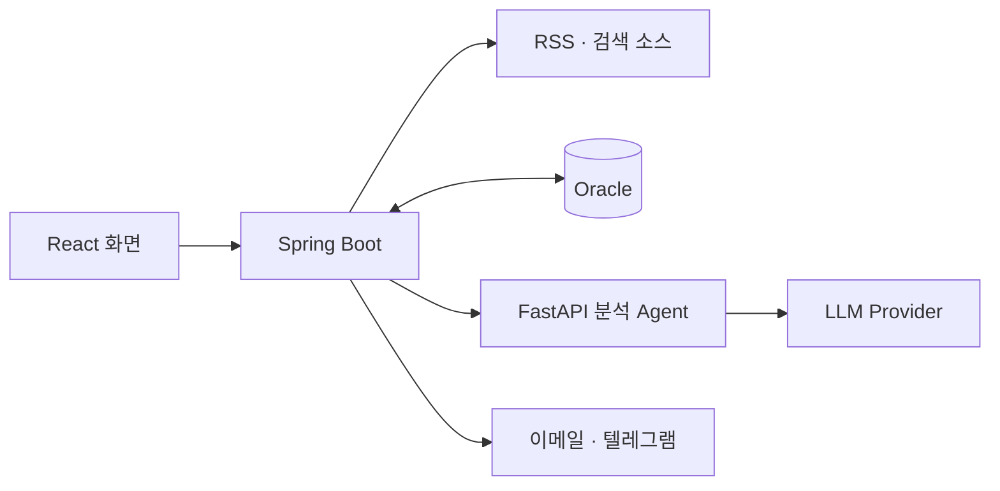

# News Signal Desk

**관심 주제의 뉴스를 모으고, 근거가 연결된 리포트로 읽는 뉴스 분석 워크스페이스**

[](https://github.com/miro-oss/external_news_agent/actions/workflows/ci.yml)

여러 매체의 뉴스를 수집하고 같은 이슈끼리 묶어, 핵심 요약부터 원문 근거까지 한 흐름으로 확인합니다. 실행별·일일 통합 리포트를 만들고 이메일과 텔레그램으로 공유할 수 있습니다.

[주요 기능](#주요-기능) · [화면 둘러보기](#화면-둘러보기) · [서비스 구조](#서비스-구조) · [실행 방법](#실행-방법)


> 화면 이미지는 데모 데이터로 촬영한 실제 애플리케이션 UI입니다.

## 주요 기능

| 흐름 | 할 수 있는 일 |
| --- | --- |
| **수집 설정** | 주제·검색 키워드·포함/제외 조건·수집 주기 등록, RSS·검색 소스 연결, 여러 주제 수집 실행 |
| **이슈 분석** | 중복 기사 구분, 관련 기사 묶기, 요약·주장과 원문 근거 연결, 독자 관점·민감도별 탐색 |
| **리포트** | 실행별·일일 통합 보고서, 핵심 요약·중요 이벤트·관찰 항목, 기사 본문과 수집 키워드 강조 |
| **공유와 알림** | 수신자·그룹 관리, 이메일·텔레그램 연결, 보고서 자동 전달과 수동 공유, 발송 이력·실패 재시도 |
| **수집 개선** | 키워드 증가 추이·연관 키워드 확인, 자동 제안 검토·승인 후 다음 수집에 반영 |

### 구현에서 신경 쓴 부분

- **이슈 단위로 읽기** — URL·본문 해시로 중복을 확인하고, 본문 유사도와 키워드·기업명·시간 조건으로 관련 기사를 묶습니다. 대표 분석과 출처를 함께 제공합니다.
- **요약의 근거 확인** — 분석 결과를 구조화하고 주장에 원문 문장을 연결합니다. 숫자·날짜·기업명·표현 강도를 검사해 근거가 부족한 표현을 걸러냅니다.
- **추가 조사 범위 제한** — Agent의 조사 제안을 Backend가 허용 소스·중복 요청·호출 예산에 맞춰 실행합니다. 분석 재검토와 추가 생성에도 횟수 제한을 둡니다.
- **전달 결과 구분** — 보고서 발송을 별도 작업으로 처리하고, 확실한 실패와 결과를 확인할 수 없는 상태를 구분해 중복 발송을 줄입니다.

## 화면 둘러보기

상단의 **수집 설정 → 리포트 → 알림 관리**에서 전체 작업을 이어갑니다. 리포트의 주요 이슈를 펼치면 관련 기사를 확인하고, 기사 상세에서 본문과 근거 문장으로 이동할 수 있습니다.

<details>
<summary><strong>수집 설정 — 주제 등록부터 실행까지</strong></summary>

주제와 기사 조건, 수집 주기를 정하고 여러 주제를 한 번에 수집합니다. 등록된 주제의 키워드 추이와 자동 제안도 같은 화면에서 확인합니다.


</details>

<details>
<summary><strong>알림 관리 — 수신자·그룹과 발송 이력</strong></summary>

수신자를 등록하고 같은 보고서를 받을 사람을 그룹으로 묶습니다. 이메일·텔레그램 연결 상태와 발송 결과를 확인합니다.


</details>

## 서비스 구조



| 구성 | 역할 |
| --- | --- |
| **Frontend** | 수집 설정·리포트·알림 UI, 서버 데이터 캐시와 사용자 입력 상태 관리 |
| **Backend** | 수집·스케줄링, 중복 제거·이슈 구성, 분석 호출·검증, DB 저장, 보고서·알림 관리 |
| **Analysis Agent** | 기사 분석, 추가 조사 제안, 리포트 생성 등 LLM 작업 수행 |
| **Oracle** | 주제·소스, 실행 기록, 기사·분석 결과, 보고서·발송 이력 저장 |

수집한 기사는 **중복 확인 → 이슈 묶기 → 근거 연결 분석 → 리포트 생성 → 선택한 대상에게 전달** 순서로 처리됩니다. 업무 데이터와 실행 상태는 Backend가 관리하고, Agent는 요청받은 분석 작업을 수행합니다.

### 기술 스택

| 영역 | 기술 |
| --- | --- |
| Frontend | React 19 · TypeScript 6 · Vite 8 · TanStack Query 5 · react-markdown |
| Backend | Java 21 · Spring Boot 4.1 · Spring Data JPA · Flyway · Jsoup · Spring Mail |
| Analysis Agent | Python · FastAPI · Pydantic · OpenAI SDK · PydanticAI(일부 추가 조사 경로) |
| Database | Oracle — CI에서 Oracle Free 23 검증 |
| 개발·검증 | pnpm · Gradle · uv · ESLint · Ruff · JUnit · pytest · GitHub Actions |

### 프로젝트 구조

```text
external_news_agent/
├── FE/                       # 웹 화면과 표시·상태 갱신 테스트
│   └── src/features/         # 수집 설정·리포트·기사 상세·알림
├── BE/                       # 수집·분석 연계·리포트·알림 서버
│   ├── src/main/             # 업무 로직과 DB 마이그레이션
│   └── scripts/              # 격리된 Oracle 테스트 실행
├── agent/                    # 분석 Agent
│   ├── app/                  # 분석 서비스·프롬프트·평가
│   └── tests/                # 분석·출력 검증 테스트
└── .github/workflows/        # Frontend · Backend · Agent CI
```

## 실행 방법

### 화면 데모 빠르게 실행하기

Node.js 24와 pnpm 11.21.0을 준비한 뒤 실행합니다.

```bash
git clone https://github.com/miro-oss/external_news_agent.git
cd external_news_agent/FE
pnpm install --frozen-lockfile
pnpm preview:refactor
```

[로컬 데모 화면](http://127.0.0.1:5187)에서 확인할 수 있습니다. 저장소의 데모 데이터를 사용하며, Backend·DB·API 키 없이 실행됩니다. 변경한 데모 상태는 서버를 다시 시작하면 초기화됩니다.

<details>
<summary><strong>전체 서비스 로컬 실행</strong></summary>

### 1. 실행 환경 준비

| 항목 | 기준 |
| --- | --- |
| Java | JDK 21, 저장소의 Gradle Wrapper 사용 |
| Node.js / pnpm | Node.js 24 / pnpm 11.21.0 |
| Python / uv | Python 3.13 권장(최소 3.12) / uv 0.12.5 이상 |
| Database | 접근 가능한 Oracle DB와 애플리케이션용 스키마 |

Oracle DB와 앱 계정은 먼저 준비해야 합니다. Backend는 Flyway로 테이블을 생성·변경하며, DB 인스턴스나 계정 자체를 만들지는 않습니다.

### 2. 환경 설정

저장소 루트에서 예제 파일을 복사합니다. 기존 설정 파일이 있으면 유지합니다.

```bash
test -e BE/.env || cp BE/.env.example BE/.env
```

`BE/.env`에 `SPRING_DATASOURCE_URL`, `SPRING_DATASOURCE_USERNAME`, `SPRING_DATASOURCE_PASSWORD`를 입력합니다. Python Agent를 연결하는 Mock 개발 모드는 다음과 같이 설정합니다.

```dotenv
AGENT_ENABLED=true
AGENT_MOCK=true
AGENT_BASE_URL=http://127.0.0.1:8088
AGENT_SHARED_SECRET=<직접 생성한 BE와 Agent 공통 내부 토큰>
```

Mock 모드는 LLM 응답을 대체합니다. 뉴스 수집을 실행하면 RSS·검색·기사 본문 요청은 실제로 수행될 수 있습니다. 예제의 기본값인 `AGENT_ENABLED=false`는 Python Agent를 호출하지 않는 설정입니다.

### 3. 세 프로세스 실행

각 명령은 **새 터미널에서 저장소 루트를 기준으로** 실행합니다.

**Analysis Agent · 8088**

```bash
cd agent
uv sync --frozen
uv run --env-file ../BE/.env uvicorn app.main:app --host 127.0.0.1 --port 8088
```

**Backend · 8080**

```bash
cd BE
./gradlew bootRun
```

**Frontend · 5173**

```bash
cd FE
pnpm install --frozen-lockfile
pnpm dev
```

- [웹 화면](http://localhost:5173)
- [서버 상태](http://localhost:8080/actuator/health)
- [Swagger UI](http://localhost:8080/swagger-ui.html)

첫 실행 후 **수집 설정**에서 주제를 등록합니다. Frontend의 `/api` 요청은 기본적으로 `localhost:8080`으로 전달됩니다.

### 4. 실제 LLM과 외부 채널 연결

실제 분석에는 `AGENT_ENABLED=true`, `AGENT_MOCK=false`와 공급자 설정이 필요합니다. OpenAI 경로는 `OPENAI_API_KEY`·`OPENAI_MODEL`, Mindlogic Claude 경로는 `MINDLOGIC_API_KEY`·`MINDLOGIC_BASE_URL`·`MINDLOGIC_CLAUDE_MODEL`을 사용합니다. 변경 후 Backend와 Agent를 모두 재시작합니다.

프로젝트의 `FREE`·`PAID`는 실행 플랜 이름입니다. `FREE` 경로도 실제 LLM 공급자의 요금이 발생할 수 있습니다. 네이버 검색, SMTP, 텔레그램은 해당 기능을 사용할 때 [환경 변수 예제](BE/.env.example)에 따라 연결합니다.

</details>

## 검증

GitHub Actions에서 Frontend 정적 검사·빌드·테스트, Agent 정적 검사·테스트·고정 데이터 재현 평가, Backend의 격리된 Oracle 통합 테스트를 실행합니다.

<details>
<summary><strong>로컬 검증 명령</strong></summary>

각 명령은 의존성을 설치한 뒤, 저장소 루트에서 새 터미널을 열어 실행합니다.

**Frontend**

```bash
cd FE
pnpm lint
pnpm build
pnpm test
```

**Analysis Agent**

```bash
cd agent
uv run ruff check .
AGENT_MOCK=1 AGENT_SHARED_SECRET=local-dev-agent-token uv run pytest
uv run python -m app.eval --profile replay --compare app/eval/golden/analyze.ko.v6.baseline.json
```

**Backend 기본 테스트**

```bash
cd BE
./gradlew test
```

**Backend Oracle 통합 테스트** — 로컬 Docker 엔진 필요

```bash
python3 -m unittest discover -s BE/scripts -p 'test_*.py'
cd BE
python3 scripts/test-db.py
```

통합 테스트 스크립트는 일회용 Oracle 컨테이너를 생성하고 검증 후 자신이 만든 컨테이너를 정리합니다. 개발용 DB 실행 도구와는 용도가 다릅니다.

</details>

세부 분석 실행과 평가 구성은 [Agent 문서](agent/README.md), 자동 검증 절차는 [CI 설정](.github/workflows/ci.yml)에서 확인할 수 있습니다.
