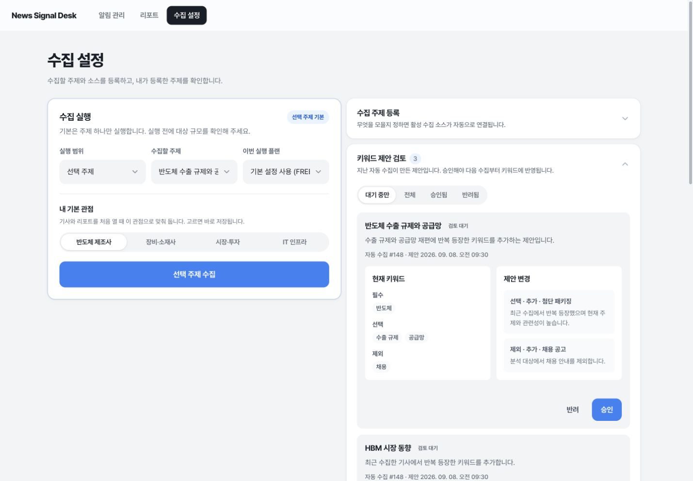
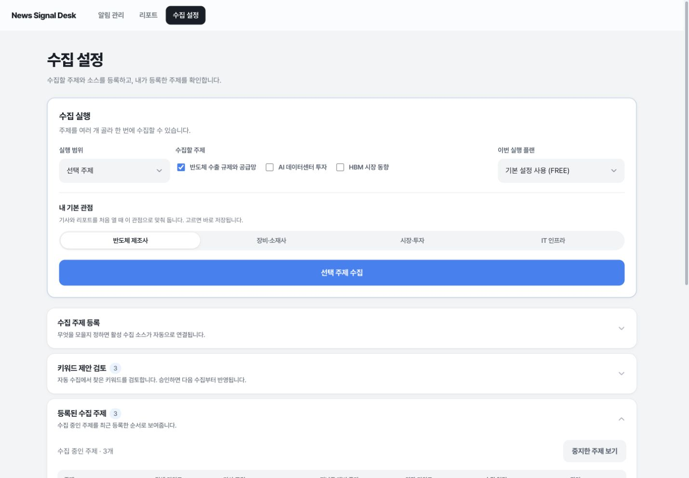
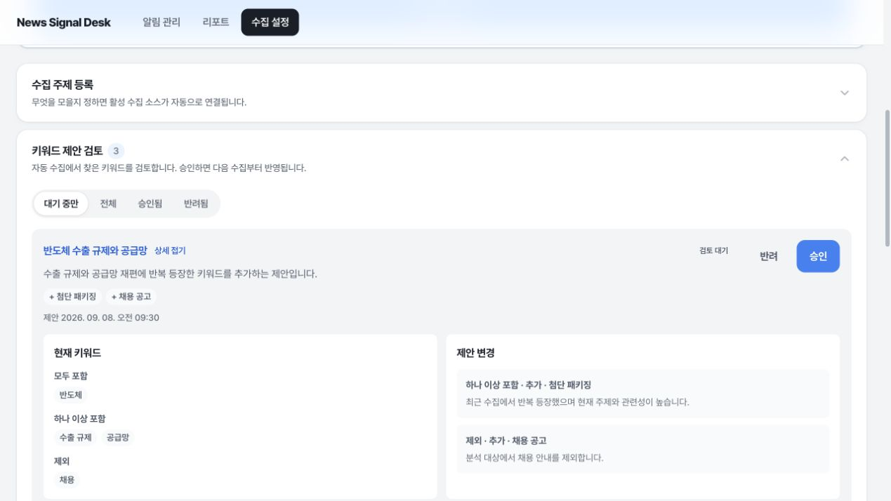
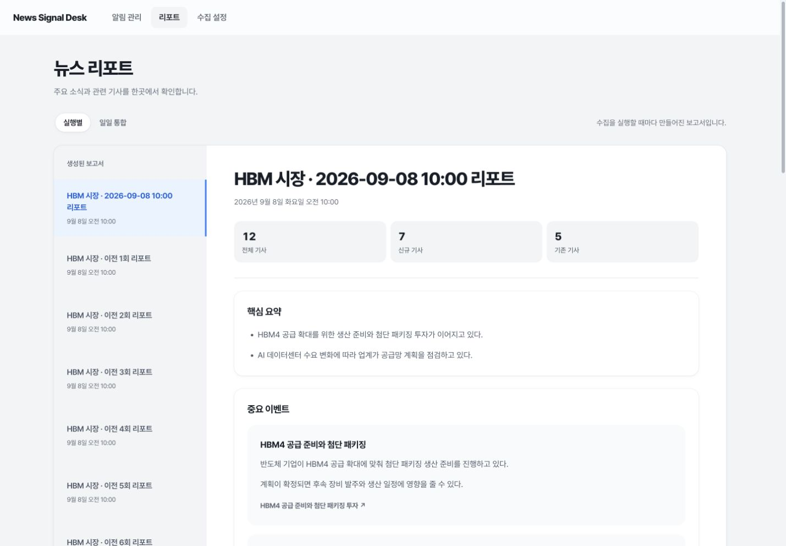
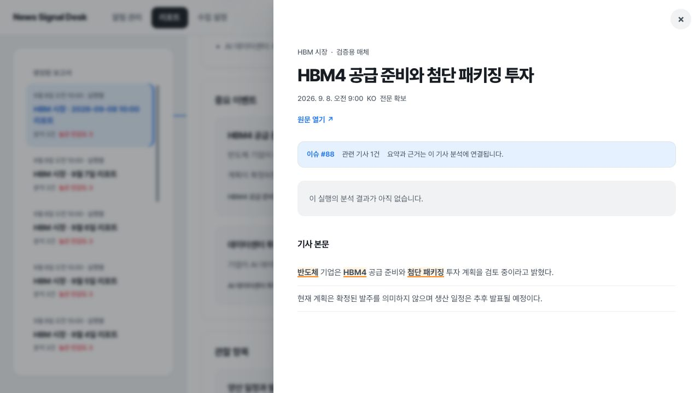
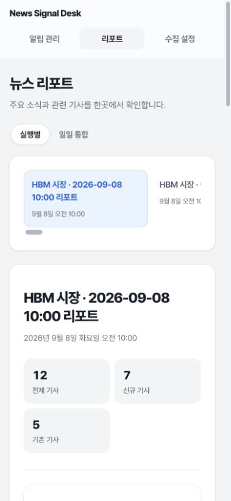

# #194 검증 기록

## 자동 검증

- `cd BE && python3 scripts/test-db.py`: 156개 클래스, 총 1,004개 중 1,001개 통과, 실패·오류 0. 새 Oracle 컨테이너에서 V40~V42를 적용하고 삭제까지 확인했다. 실제 DB/크롤러/LLM/메일/Telegram은 사용하지 않았다.
- 제외 3개: 독립 골든 데이터 export 2개, 별도 Mailpit 실전송 1개. Oracle 통합 테스트는 포함했다.
- `python3 -m unittest discover -s BE/scripts -p 'test_*.py'`: 격리 DB 실행기 검증 23개 통과.
- `cd FE && pnpm lint && pnpm build && pnpm test`: lint·production build 및 입력/원문/기존 보고서/전달 대상 회귀 11개 통과. CI에도 pnpm test를 연결했다.
- `git diff --check`: 통과.

## 브라우저 검증

현재 소스와 main의 화면을 모의 API로 실행해 CUA 브라우저에서 비교했다. 공통 색상·radius·그림자·padding·버튼 모션 토큰을 유지했고, 신규 보고서 카드도 같은 토큰을 사용한다.

- 제안이 있는 상태에서 펼침 → 새로고침 → 기본 닫힘 확인. 전체 폭의 요약 행에서 개별 변경 상세를 펼쳐 확인했다.
- 등록 화면의 검색 키워드 입력이 하나이며 상세 조건은 별도 펼침. 기본 24시간 확인. `HBM, 반도체` 등록 후 최신 행이 맨 위에 나타났다.
- 수집 중지 시 활성 목록에서 빠지고, 중지 목록에서 재개할 수 있다.
- 두 주제 선택 후 수집을 접수했다. 두 번 클릭해 같은 idempotencyKey/topicIds를 전송하고 하나의 대기 요청으로 유지하는 것을 fixture 요청 로그에서 확인했다.
- 주제별 그룹·개인·이메일+Telegram 자동 전달 선택을 저장했다. 삭제·중지된 기존 선택은 경고와 해제 버튼으로 표시하며 잘못된 활성 설정의 저장을 막는다. 자동 전달 끄기는 기존 선택이 없어졌어도 가능하다.
- Telegram 연결 → 링크/Start 안내 → CONNECTED 상태 전환을 확인했다. 모의 링크만 사용했으며 외부 메시지를 발송하지 않았다.
- 보고서 실행별 기본, 일일 통합 전환, 목록 선택 표시, 구조화·기존 markdown 표시, 접힌 기타 분석, 하단 공유와 요약 미리보기를 확인했다.
- 앱 내 기사 원문에서 `반도체`, `HBM4`, `첨단 패키징`만 mark로 표시하고 전체 원문 문자열을 유지했다. 수집 키워드 태그는 추가하지 않았다.
- 모바일 390px에서 보고서 레일의 min-width 문제를 수정했다. 설정·보고서 모두 document scrollWidth와 clientWidth가 379px(스크롤바 제외)로 같아 페이지 가로 넘침이 없다.

재현 명령과 단계는 [모의 화면 안내](preview-qa.md)를 참고한다.

### 보고서 여백과 목록·본문 연결

- 보고서 제목의 카드 상단 간격을 24px에서 40px로 늘렸다. 목록 제목의 상단 간격은 36px에서 24px로 줄이고 목록 항목의 텍스트와 가로 정렬을 맞췄다.
- 사용자 참고 이미지에 맞춰 데스크톱 목록을 직선형 사이드바로 구성했다. 선택 행 전체에 기존 옅은 파란색을 적용하고 본문에 닿는 오른쪽 끝에 3px 파란 포인트를 표시한다. 둥근 외곽 카드와 흰 본문은 유지한다. 굴곡진 연결 모양·위치 측정 코드 없이 CSS로 구현했다.
- 본문 전체의 좌우 여백은 화면 폭에 따라 32~56px로 늘렸다(1440px에서 약 50px, 920px에서 약 32px). 제목·통계·본문 카드가 같은 기준선으로 정렬된다. 제목 위 40px 여백은 유지했다.
- CUA에서 1440px·920px·390px을 확인했다. 데스크톱의 선택 항목 오른쪽과 본문 왼쪽 좌표 차이는 0px이며, 목록 끝 항목 선택 시 스크롤과 본문 제목 일치를 확인했다. 목록 제목과 행의 텍스트 시작점 차이는 0px, 일반 행과 선택 행 높이는 모두 104px이다.
- 모바일에서는 기존 가로 목록·둥근 선택 카드·스크롤바와 24px 본문 여백을 유지한다. 세 화면 모두 페이지 가로 넘침이 없다.
- 목록 폭은 230~280px로 제한하고 제목(최대 두 줄)과 생성 시간만 표시한다. 목록의 반복 분석 건수·빨간 민감도 숫자·범위 문구를 제거했다. 전체 제목은 접근 가능한 텍스트와 title 속성에 보존하며 본문 통계와 이슈 정보는 유지한다. 데스크톱 스크롤바 공간과 RTL 배치를 제거해 오른쪽 선택 표시가 본문 경계에 붙는다. overflow 스크롤과 버튼 초점 표시는 유지했다.
- 상단 메뉴 선택 배경은 목록과 동일한 `--line-soft`(#f2f4f6), 글자는 `--fg`로 변경했다. CUA에서 알림 관리·리포트·수집 설정 전환과 회색 선택 면 위치를 확인했다. 모바일 메뉴 트랙은 투명하게 바꿔 회색 선택 면이 구분된다. 기존 선택 이동·크기 애니메이션은 유지했다.
- 보완 후 `cd FE && pnpm lint && pnpm build && pnpm test` 재실행: lint·build 및 테스트 11개 통과.

## 운영 확인과 한계

- 기존 기동 서버에 읽기 요청만 수행했다. 이메일 채널은 활성·SMTP 465 설정이지만 조회된 이메일 발송 이력은 0건이라 SMTP 실패를 확정할 수 없다. 메일 서버 접수와 실제 수신함 도착은 다르며, 이번 작업에서는 실제 수신자에게 시험 메일을 보내지 않았다.
- 전달 UI는 복수 채널/개인 선택과 채널별 결과를 제공한다. 자동 전달은 저장한 요약을 사용하며 확정 실패만 재시도한다. 결과가 불명확한 전송을 자동 재발송하지 않는다.
- 접수 당시 키워드가 없는 기존 보고서는 현재 주제로 소급해서 강조하지 않는다.
- 수집 실행 복구는 기존 단일 서버 운영 전제를 유지한다. 여러 서버에서 실행 소유권을 복구하는 lease 설계는 추가하지 않았다.
- 사용자 선행 변경 `BE/.env.example`은 수정·커밋하지 않았다.

## 화면

| 수집 설정 전 | 수집 설정 후 |
|---|---|
|  |  |

